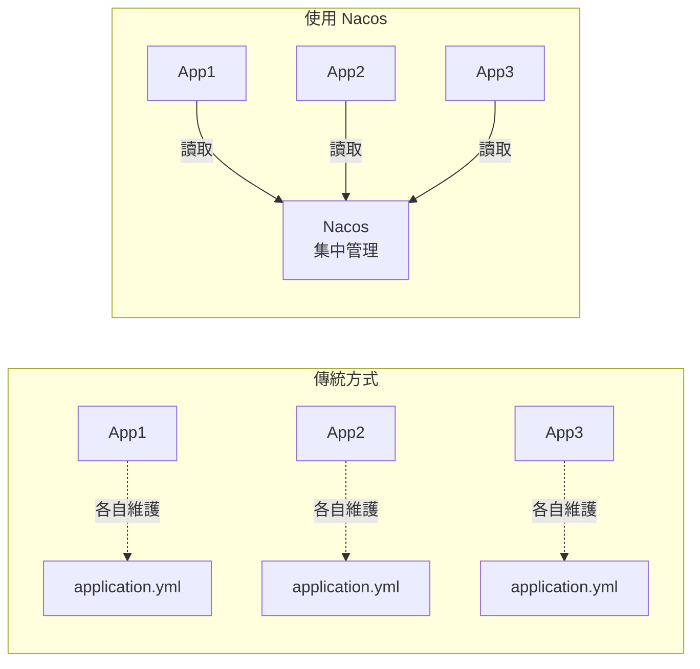
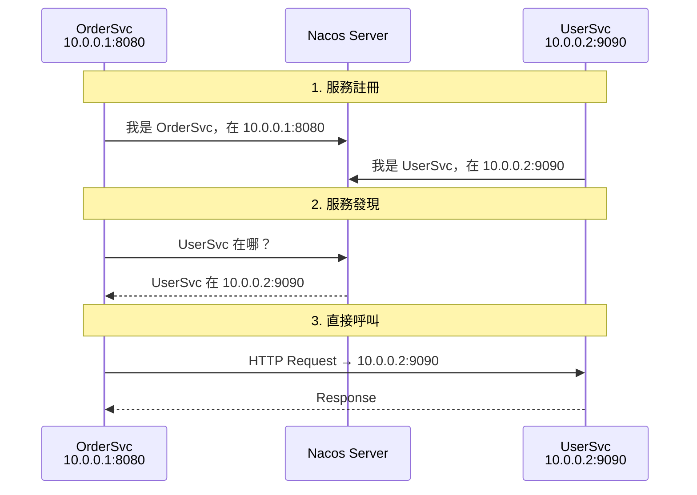
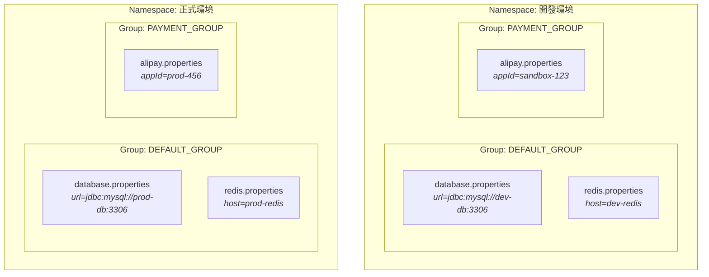
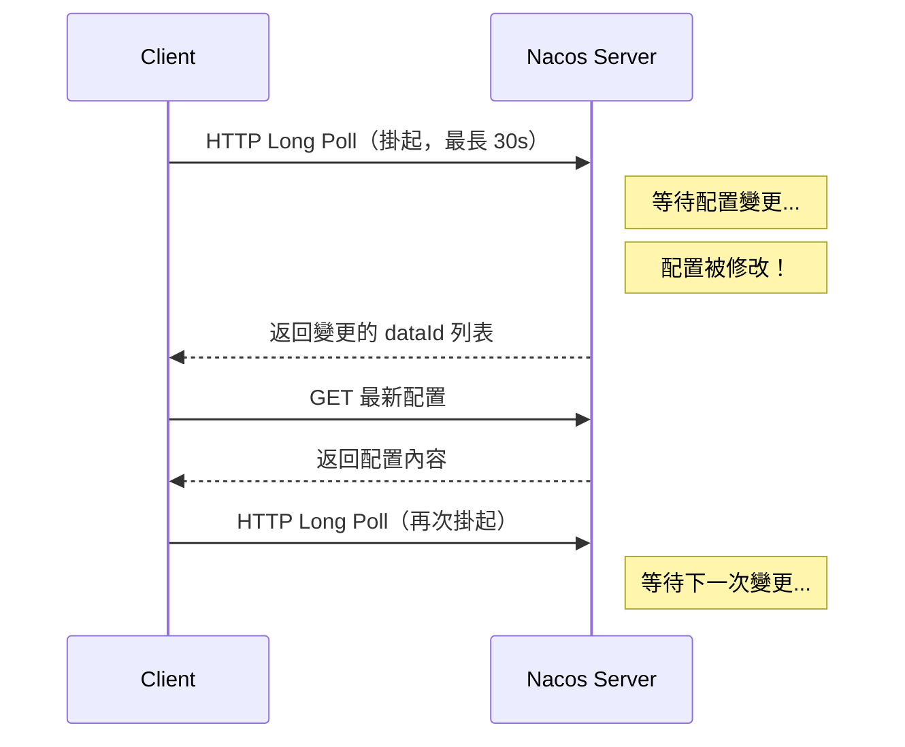
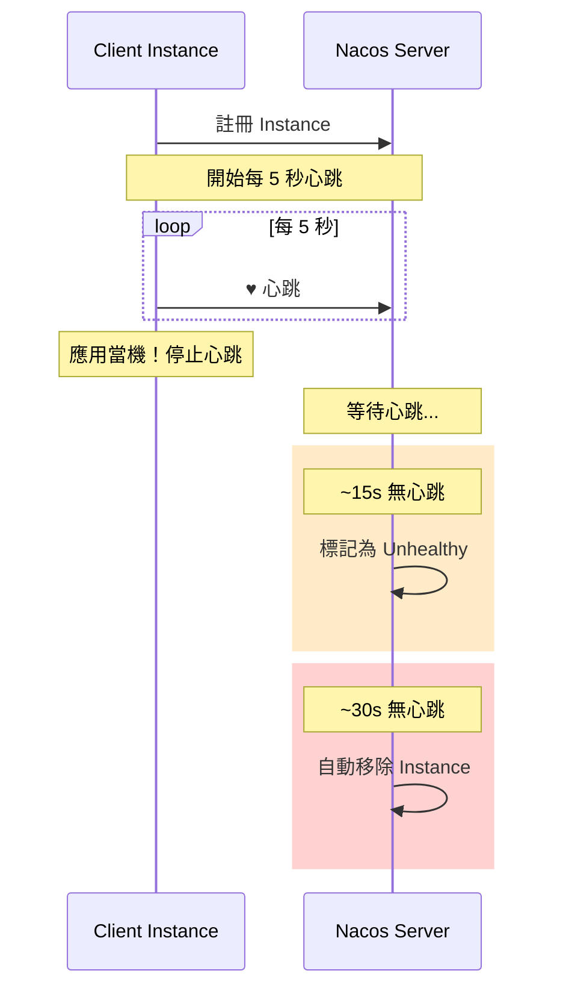

# Nacos 1.4.6 PoC 專案

Nacos 1.4.6 Java SDK 功能驗證（Proof of Concept），涵蓋**配置管理**、**服務發現**、**命名空間隔離**與**認證機制**。

本專案同時提供完整的**初學者教學**，幫助你從零理解 Nacos 的核心概念與使用方式。

---

## 目錄

- [什麼是 Nacos？](#什麼是-nacos)
- [核心概念教學](#核心概念教學)
- [技術棧](#技術棧)
- [專案結構](#專案結構)
- [快速開始](#快速開始)
- [PoC 測試結果總覽](#poc-測試結果總覽)
- [功能詳解與程式碼導讀](#功能詳解與程式碼導讀)
  - [1. 配置管理 (Configuration Management)](#1-配置管理-configuration-management)
  - [2. 配置監聽 (Config Listener)](#2-配置監聽-config-listener)
  - [3. 服務註冊 (Service Registration)](#3-服務註冊-service-registration)
  - [4. 服務發現 (Service Discovery)](#4-服務發現-service-discovery)
  - [5. 健康檢查 (Health Check)](#5-健康檢查-health-check)
  - [6. 命名空間與群組隔離 (Namespace & Group)](#6-命名空間與群組隔離-namespace--group)
  - [7. 認證機制 (Authentication)](#7-認證機制-authentication)
- [Demo 執行方式](#demo-執行方式)
- [常見問題](#常見問題)
- [延伸閱讀](#延伸閱讀)

---

## 什麼是 Nacos？

**Nacos**（Dynamic **Na**ming and **Co**nfiguration **S**ervice）是阿里巴巴開源的服務發現與配置管理平台。

簡單來說，Nacos 幫你解決兩個問題：

### 問題一：配置管理

> 「我的應用程式有幾十個設定檔，部署了 20 台機器，每次改設定都要改 20 次？」

Nacos 讓你把配置**集中存放在一個地方**，所有應用程式都來這裡讀取，改一次就全部生效。



### 問題二：服務發現

> 「微服務架構下，Service A 怎麼知道 Service B 在哪台機器、哪個 Port？」

每個服務啟動時向 Nacos **註冊**自己的位址，要呼叫其他服務時去 Nacos **查詢**。



---

## 核心概念教學

### 配置管理的三個關鍵字

| 概念 | 說明 | 類比 |
|------|------|------|
| **DataId** | 配置的唯一名稱 | 檔案名稱，如 `database.properties` |
| **Group** | 配置的分組 | 資料夾，如 `DEV_GROUP`、`PROD_GROUP` |
| **Namespace** | 配置的命名空間 | 硬碟分割槽，如「開發環境」、「正式環境」 |

三者組合成唯一索引：`Namespace → Group → DataId`



### 服務發現的三個角色

| 角色 | 說明 |
|------|------|
| **Service Provider** | 提供服務的應用，啟動後向 Nacos 註冊 |
| **Service Consumer** | 需要呼叫其他服務的應用，向 Nacos 查詢目標位址 |
| **Nacos Server** | 服務登記簿，維護所有服務的位址清單 |

### Ephemeral vs Persistent Instance

| 類型 | 生命週期 | 健康檢查 | 適用場景 |
|------|----------|----------|----------|
| **Ephemeral**（臨時） | 靠心跳維持，停止心跳就移除 | Client 主動上報 | 應用服務（會動態擴縮） |
| **Persistent**（持久） | 手動刪除才會移除 | Server 主動探測 | 基礎設施（DB、MQ） |

本 PoC 中所有 Instance 皆為 Ephemeral（Nacos 預設）。

---

## 技術棧

| 元件 | 選擇 | 版本 |
|------|------|------|
| Language | Java | 8 |
| Framework | Spring Boot | 2.7.18 |
| Build | Maven | - |
| Nacos SDK | nacos-client | 1.4.6 |
| Test Framework | JUnit 4 | 4.13.2 |
| Container Testing | Testcontainers | 1.20.4 |
| Async Assertions | Awaitility | 4.2.0 |
| Assertions | AssertJ | 3.22.0 |
| Logging | SLF4J + Logback | 1.7.36 / 1.2.12 |
| Docker Image | nacos/nacos-server | v1.4.6 |

---

## 專案結構

```
nacos1x-poc/
├── .gitignore
├── pom.xml                            # Maven 設定（Spring Boot 2 parent）
├── docker-compose.yml                 # Nacos standalone + auth 容器
├── README.md                          # 本文件
├── docs/
│   └── nacos-1x-vs-2x-comparison.md   # Nacos 1.x vs 2.x 完整比較
├── src/
│   ├── main/java/com/example/nacos/
│   │   ├── NacosClientFactory.java    # SDK 工廠類別
│   │   ├── config/
│   │   │   └── ConfigDemo.java        # 配置管理互動 Demo
│   │   └── discovery/
│   │       └── ServiceDiscoveryDemo.java  # 服務發現互動 Demo
│   └── test/java/com/example/nacos/
│       ├── NacosTestBase.java         # 測試基礎類別（Testcontainers）
│       ├── config/
│       │   ├── ConfigBasicTest.java       # 配置 CRUD（5 tests）
│       │   └── ConfigListenerTest.java    # 配置監聽（3 tests）
│       ├── discovery/
│       │   ├── ServiceRegistrationTest.java  # 服務註冊（4 tests）
│       │   ├── ServiceDiscoveryTest.java     # 服務發現（4 tests）
│       │   └── HealthCheckTest.java          # 健康檢查（2 tests）
│       ├── namespace/
│       │   └── NamespaceGroupTest.java    # 命名空間隔離（3 tests）
│       └── auth/
│           └── AuthenticationTest.java    # 認證機制（2 tests）
```

---

## 快速開始

### 前置需求

- **JDK 8**+
- **Maven** 3.6+
- **Docker** & **Docker Compose**（用於 Testcontainers 和 Demo）

### 執行整合測試

**方式一：Testcontainers 自動啟動**（適合 x86/amd64 環境）

```bash
mvn test
```

**方式二：外部 Nacos**（適合 Apple Silicon / 已有 Nacos 環境）

```bash
# 1. 啟動主要 Nacos（standalone）
docker run -d --name nacos-standalone \
  -e MODE=standalone -e PREFER_HOST_MODE=hostname \
  -e JVM_XMS=256m -e JVM_XMX=256m -e JVM_XMN=128m \
  -p 8848:8848 nacos/nacos-server:v1.4.6

# 2. 等待就緒（Apple Silicon 約 40-60 秒）
until curl -s http://localhost:8848/nacos/v1/console/health/readiness | grep -q OK; do sleep 5; done

# 3. 執行非認證測試（21 tests）
NACOS_SERVER_ADDR=127.0.0.1:8848 mvn test \
  -Dtest='ConfigBasicTest,ConfigListenerTest,ServiceRegistrationTest,ServiceDiscoveryTest,HealthCheckTest,NamespaceGroupTest'

# 4. 停止主要 Nacos，啟動認證 Nacos（避免同時運行兩個 JVM）
docker stop nacos-standalone
docker run -d --name nacos-auth \
  -e MODE=standalone -e PREFER_HOST_MODE=hostname \
  -e JVM_XMS=256m -e JVM_XMX=256m -e JVM_XMN=128m \
  -e NACOS_AUTH_ENABLE=true \
  -e NACOS_AUTH_IDENTITY_KEY=serverIdentity \
  -e NACOS_AUTH_IDENTITY_VALUE=security \
  -e NACOS_AUTH_TOKEN=SecretKey012345678901234567890123456789012345678901234567890123456789 \
  -p 8849:8848 nacos/nacos-server:v1.4.6

# 5. 等待認證 Nacos 就緒
until curl -s http://localhost:8849/nacos/v1/console/health/readiness | grep -q OK; do sleep 5; done

# 6. 執行認證測試（2 tests）
NACOS_SERVER_ADDR=127.0.0.1:8849 NACOS_AUTH_SERVER_ADDR=127.0.0.1:8849 mvn test \
  -Dtest='AuthenticationTest'

# 7. 清理
docker rm -f nacos-standalone nacos-auth
```

> 第一次執行會下載 `nacos/nacos-server:v1.4.6` Docker Image，約 300MB。

### 手動執行 Demo

```bash
# 1. 用 Docker Compose 啟動 Nacos
docker-compose up -d

# 2. 等待 Nacos 就緒（約 30 秒）
curl http://localhost:8848/nacos/v1/console/health/readiness

# 3. 執行配置管理 Demo
mvn exec:java -Dexec.mainClass="com.example.nacos.config.ConfigDemo"

# 4. 執行服務發現 Demo
mvn exec:java -Dexec.mainClass="com.example.nacos.discovery.ServiceDiscoveryDemo"

# 5. 開啟 Nacos Console 查看
#    URL: http://localhost:8848/nacos
#    帳號/密碼: nacos / nacos

# 6. 停止
docker-compose down
```

---

## PoC 測試結果總覽

### 23 個測試全數通過，7 個測試類別

| 測試類別 | 測試數 | 驗證功能 | 耗時 | 結果 |
|----------|--------|----------|------|------|
| `ConfigBasicTest` | 5 | 配置 CRUD + Group 隔離 | ~9s | ✅ |
| `ConfigListenerTest` | 3 | 配置變更監聽 + 移除監聽 | ~37s | ✅ |
| `ServiceRegistrationTest` | 4 | 服務註冊/反註冊/多實例/Metadata | ~2s | ✅ |
| `ServiceDiscoveryTest` | 4 | 查詢/篩選/訂閱/負載均衡 | ~2s | ✅ |
| `HealthCheckTest` | 2 | 心跳超時 → 不健康 → 自動移除 | ~65s | ✅ |
| `NamespaceGroupTest` | 3 | Namespace 與 Group 資料隔離 | ~5s | ✅ |
| `AuthenticationTest` | 2 | 認證存取 + 未認證拒絕 | ~4s | ✅ |

> **測試環境**：macOS (Apple Silicon M-series), JDK 23 (Corretto), Nacos v1.4.6 amd64 via qemu
> **總耗時**：非認證測試 ~2 分鐘、認證測試 ~5 秒（不含容器啟動時間）

### PoC 關鍵發現

| 功能 | Nacos 1.4.6 表現 | 備註 |
|------|-------------------|------|
| 配置 CRUD | 穩定可靠 | publishConfig 後約 1s 可讀取 |
| 配置監聽 | Long Polling 機制 | 變更通知延遲 1-10 秒（非即時） |
| 服務註冊 | 即時生效 | 註冊後立即可查詢 |
| 心跳機制 | 5 秒間隔 | 停止心跳 ~15s 標記不健康，~30s 自動移除 |
| Namespace 隔離 | 完全隔離 | 不同 Namespace 的配置/服務互不可見 |
| Group 隔離 | 完全隔離 | 同 Namespace 下不同 Group 互不干擾 |
| 認證 | Basic Auth (JWT) | 開啟 auth 後未認證請求被拒絕 |
| UDP 服務推送 | 不完全可靠 | 需搭配 polling 做 failover |

### 已知限制

- **配置推送延遲**：Long Polling 機制，最長 30 秒（2.x 使用 gRPC 可達毫秒級）
- **UDP 推送不可靠**：服務變更通知透過 UDP，可能丟包
- **無 RBAC**：1.x 僅支援 Namespace 級別的基本認證，無角色權限控制
- **無配置加密**：配置明文儲存
- **心跳開銷**：每個 Ephemeral Instance 每 5 秒發一次 HTTP 心跳
- **僅提供 amd64 映像檔**：`nacos/nacos-server:v1.4.6` 無 ARM 原生映像檔，Apple Silicon 需透過 qemu 模擬

> 詳細的 1.x vs 2.x 差異比較請參考 [docs/nacos-1x-vs-2x-comparison.md](docs/nacos-1x-vs-2x-comparison.md)

---

## 功能詳解與程式碼導讀

### 1. 配置管理 (Configuration Management)

> 對應檔案：`ConfigBasicTest.java`

配置管理是 Nacos 最基礎的功能。所有操作都透過 `ConfigService` 介面。

#### 建立 ConfigService

```java
// 透過 NacosClientFactory 建立（見 NacosClientFactory.java）
Properties properties = new Properties();
properties.setProperty("serverAddr", "127.0.0.1:8848");
ConfigService configService = NacosFactory.createConfigService(properties);
```

#### 發布配置（Create / Update）

```java
String dataId = "database.properties";
String group = "DEFAULT_GROUP";
String content = "url=jdbc:mysql://localhost:3306/mydb\nusername=root";

// publishConfig 同時用於新建和更新
boolean success = configService.publishConfig(dataId, group, content);
// success = true 表示發布成功
```

#### 讀取配置（Read）

```java
// 第三個參數是超時時間（毫秒）
String config = configService.getConfig(dataId, group, 5000);
// config = "url=jdbc:mysql://localhost:3306/mydb\nusername=root"
// 若配置不存在，返回 null
```

#### 刪除配置（Delete）

```java
boolean removed = configService.removeConfig(dataId, group);
// 刪除後 getConfig 返回 null
```

#### Group 隔離

同一個 DataId 在不同 Group 下是獨立的：

```java
configService.publishConfig("app.yml", "DEV_GROUP", "env=dev");
configService.publishConfig("app.yml", "PROD_GROUP", "env=prod");

configService.getConfig("app.yml", "DEV_GROUP", 5000);  // → "env=dev"
configService.getConfig("app.yml", "PROD_GROUP", 5000);  // → "env=prod"
```

---

### 2. 配置監聽 (Config Listener)

> 對應檔案：`ConfigListenerTest.java`

當配置發生變更時，Nacos 會通知所有監聽者。1.x 使用 **Long Polling** 機制。

#### 原理圖



#### 新增監聽器

```java
configService.addListener(dataId, group, new Listener() {
    @Override
    public Executor getExecutor() {
        return null; // 使用預設執行緒
    }

    @Override
    public void receiveConfigInfo(String configInfo) {
        // configInfo 是變更後的完整配置內容
        System.out.println("配置已變更: " + configInfo);
    }
});
```

#### 移除監聽器

```java
configService.removeListener(dataId, group, listener);
// 移除後不再收到通知
```

> **初學者提示**：測試中使用 `Awaitility` 等待非同步通知，避免用 `Thread.sleep` 造成測試不穩定。

---

### 3. 服務註冊 (Service Registration)

> 對應檔案：`ServiceRegistrationTest.java`

服務註冊透過 `NamingService` 介面操作。

#### 基本註冊

```java
NamingService namingService = NacosFactory.createNamingService("127.0.0.1:8848");

// 最簡單的註冊方式：服務名 + IP + Port
namingService.registerInstance("order-service", "192.168.1.1", 8080);
```

#### 帶 Metadata 的註冊

```java
Instance instance = new Instance();
instance.setIp("192.168.1.1");
instance.setPort(8080);
instance.setWeight(2.0);  // 權重，用於負載均衡

Map<String, String> metadata = new HashMap<>();
metadata.put("version", "v2.0");       // 版本標記
metadata.put("region", "us-east-1");   // 區域標記
instance.setMetadata(metadata);

namingService.registerInstance("order-service", instance);
```

#### 反註冊

```java
namingService.deregisterInstance("order-service", "192.168.1.1", 8080);
```

---

### 4. 服務發現 (Service Discovery)

> 對應檔案：`ServiceDiscoveryTest.java`

#### 查詢所有實例

```java
List<Instance> all = namingService.getAllInstances("order-service");
// 包含健康和不健康的所有實例
```

#### 僅查詢健康實例

```java
List<Instance> healthy = namingService.selectInstances("order-service", true);
// 只返回 isHealthy() == true 的實例
```

#### 負載均衡選擇

```java
// Nacos 內建負載均衡，根據權重隨機選擇一個健康實例
Instance selected = namingService.selectOneHealthyInstance("order-service");
System.out.println(selected.getIp() + ":" + selected.getPort());
```

#### 訂閱服務變更

```java
namingService.subscribe("order-service", new EventListener() {
    @Override
    public void onEvent(Event event) {
        if (event instanceof NamingEvent) {
            NamingEvent ne = (NamingEvent) event;
            List<Instance> instances = ne.getInstances();
            System.out.println("服務實例變更，目前數量: " + instances.size());
        }
    }
});
```

---

### 5. 健康檢查 (Health Check)

> 對應檔案：`HealthCheckTest.java`

Nacos 1.x 的 Ephemeral Instance 靠 **Client 心跳** 維持健康狀態。

#### 心跳時間線



#### 測試驗證

```java
// 建立臨時的 NamingService 並註冊
NamingService tempNaming = createFactory().createNamingService();
tempNaming.registerInstance(serviceName, "10.5.0.1", 8080);

// 關閉 → 停止心跳
tempNaming.shutDown();

// ~15s 後變成不健康
// ~30s 後被自動移除
```

> **初學者提示**：這就是為什麼微服務應用當機後，Nacos 能自動將它從服務清單移除——因為心跳停了。

---

### 6. 命名空間與群組隔離 (Namespace & Group)

> 對應檔案：`NamespaceGroupTest.java`

#### Namespace 隔離

不同 Namespace 下的配置和服務**完全不可見**。

```java
// 建立命名空間（透過 HTTP API）
// POST /nacos/v1/console/namespaces
// body: customNamespaceId=dev&namespaceName=開發環境

// 建立指向不同 Namespace 的 Client
ConfigService configDev = factory.createConfigService("dev-namespace-id");
ConfigService configProd = factory.createConfigService("prod-namespace-id");

// 同一個 dataId，不同 namespace → 完全獨立
configDev.publishConfig("app.yml", "DEFAULT_GROUP", "env=dev");
configProd.publishConfig("app.yml", "DEFAULT_GROUP", "env=prod");

configDev.getConfig("app.yml", "DEFAULT_GROUP", 5000);   // → "env=dev"
configProd.getConfig("app.yml", "DEFAULT_GROUP", 5000);   // → "env=prod"
```

#### 常見隔離策略

```mermaid
graph TD
    subgraph 方案三：組合使用
        subgraph DEV[Namespace: dev]
            DU[Group: USER_SERVICE]
            DO[Group: ORDER_SERVICE]
        end
        subgraph PROD[Namespace: production]
            PU[Group: USER_SERVICE]
            PO[Group: ORDER_SERVICE]
        end
    end

    style DEV fill:#e8f5e9
    style PROD fill:#fff3e0
```

| 方案 | 隔離維度 | 適用場景 |
|------|----------|----------|
| Namespace 隔離環境 | dev / staging / production | 多環境部署 |
| Group 隔離專案 | USER_SERVICE / ORDER_SERVICE | 單一環境多專案 |
| 組合使用 | Namespace × Group | 多環境 + 多專案 |

---

### 7. 認證機制 (Authentication)

> 對應檔案：`AuthenticationTest.java`

Nacos 1.x 支援基本的 Username/Password 認證。

#### 啟用認證

```yaml
# docker-compose.yml 或 Nacos 設定
NACOS_AUTH_ENABLE=true
```

#### 帶認證的存取

```java
Properties properties = new Properties();
properties.setProperty("serverAddr", "127.0.0.1:8848");
properties.setProperty("username", "nacos");
properties.setProperty("password", "nacos");
ConfigService configService = NacosFactory.createConfigService(properties);

// 正常操作
configService.publishConfig(dataId, group, content); // ✅ 成功
```

#### 未認證的存取

```java
// 不提供帳密
Properties properties = new Properties();
properties.setProperty("serverAddr", "127.0.0.1:8848");
ConfigService configService = NacosFactory.createConfigService(properties);

configService.publishConfig(dataId, group, content); // ❌ NacosException
```

---

## Demo 執行方式

### ConfigDemo 輸出範例

```
=== Step 1: Publish Config ===
Published: true

=== Step 2: Get Config ===
Config content:
app.name=nacos-demo
app.version=1.0.0
app.env=development

=== Step 3: Add Config Listener ===
Listener registered

=== Step 4: Update Config ===
Config updated, waiting for listener notification...
[Listener] Config changed! New content:
app.name=nacos-demo
app.version=2.0.0
app.env=production
Listener notified: true

=== Step 5: Verify Updated Config ===
Updated config:
app.name=nacos-demo
app.version=2.0.0
app.env=production

=== Step 6: Remove Config ===
Removed: true
Config after remove: null

=== Config Demo Complete ===
```

### ServiceDiscoveryDemo 輸出範例

```
=== Step 1: Subscribe to Service ===
Subscribed to 'demo-service'

=== Step 2: Register Instances ===
Registered instance 1: 192.168.1.10:8080
Registered instance 2: 192.168.1.11:8080 (weight=2.0, metadata)
[Subscriber] Service changed! Instances: 2
  - 192.168.1.10:8080 (healthy=true, metadata={})
  - 192.168.1.11:8080 (healthy=true, metadata={version=v2.0, region=us-west-2})

=== Step 3: Discover All Instances ===
Total instances: 2
  - 192.168.1.10:8080 weight=1.0 healthy=true metadata={}
  - 192.168.1.11:8080 weight=2.0 healthy=true metadata={version=v2.0, region=us-west-2}

=== Step 4: Get Healthy Instances ===
Healthy instances: 2

=== Step 5: Select One Healthy Instance (Load Balancing) ===
  Selected: 192.168.1.11:8080 (weight=2.0)
  Selected: 192.168.1.11:8080 (weight=2.0)
  Selected: 192.168.1.10:8080 (weight=1.0)
  Selected: 192.168.1.11:8080 (weight=2.0)
  Selected: 192.168.1.11:8080 (weight=2.0)

=== Step 6: Deregister Instances ===
Deregistered 192.168.1.10:8080
Remaining instances: 1

=== Service Discovery Demo Complete ===
```

> 注意 Step 5 中 weight=2.0 的實例被選中的機率較高（約 2/3），這就是加權隨機負載均衡。

---

## 常見問題

### Q: 測試執行很慢？

Nacos 容器啟動需要 30-60 秒，但所有測試**共用同一個容器**（Singleton Pattern），只需啟動一次。`HealthCheckTest` 需要等待心跳超時，單獨約需 30-60 秒。

### Q: 測試顯示 Docker 相關錯誤？

確認 Docker daemon 正在運行：

```bash
docker info
```

如使用 Rancher Desktop 或其他非標準 Docker，可能需要額外設定：

```bash
# Rancher Desktop socket 路徑（加到 ~/.testcontainers.properties）
docker.host=unix:///Users/<username>/.rd/docker.sock

# 停用 Ryuk（解決某些環境下的 mount 問題）
export TESTCONTAINERS_RYUK_DISABLED=true
```

### Q: Apple Silicon (M1/M2/M3/M4) 上遇到問題？

`nacos/nacos-server:v1.4.6` 只提供 amd64 映像檔，在 ARM 上透過 qemu 模擬運行，有以下注意事項：

**1. 不要同時啟動兩個 Nacos 容器**

兩個模擬的 amd64 JVM 同時運行會消耗大量資源，容易導致 OOM（exit code 137）或 Derby 資料庫逾時。請**依序啟動**，參考[快速開始](#執行整合測試)方式二的步驟。

**2. JVM 記憶體設定**

必須設定 `JVM_XMN` 小於 `JVM_XMX`，否則 Old Generation 無可用空間：

```bash
# 正確
-e JVM_XMS=256m -e JVM_XMX=256m -e JVM_XMN=128m

# 錯誤（XMN 預設等於 XMS，Old Gen 為 0）
-e JVM_XMS=256m -e JVM_XMX=256m
```

**3. inotify 限制**

如遇到 `User limit of inotify instances reached` 錯誤：

```bash
docker run --rm --privileged --pid=host alpine \
  nsenter -t 1 -m -u -n -i -- sysctl -w fs.inotify.max_user_instances=1024
```

**4. Docker API 版本**

如遇到 `API version is too old` 錯誤，本專案已在 `src/test/resources/docker-java.properties` 中設定 `api.version=1.44`。

**5. 認證容器需要額外參數**

Nacos 1.4.6 啟用認證時，必須設定身份驗證參數，否則啟動會失敗：

```bash
-e NACOS_AUTH_ENABLE=true
-e NACOS_AUTH_IDENTITY_KEY=serverIdentity
-e NACOS_AUTH_IDENTITY_VALUE=security
-e NACOS_AUTH_TOKEN=SecretKey012345678901234567890123456789012345678901234567890123456789
```

### Q: 為什麼不用 Spring Cloud Alibaba？

本專案目的是展示 **Nacos 原生 SDK**（`nacos-client`），直接操作 `ConfigService` 和 `NamingService` API。這樣能更深入理解底層機制，不被框架封裝遮蔽。Spring Boot 2 在此作為依賴管理與應用框架使用。

### Q: 1.4.6 是不是太舊了？

如果是新專案，建議使用 Nacos 2.x。本 PoC 的目的是理解 1.x 的行為特性，為既有系統的維護和遷移決策提供依據。詳見 [1.x vs 2.x 比較文件](docs/nacos-1x-vs-2x-comparison.md)。

---

## 延伸閱讀

- [Nacos 官方文件](https://nacos.io/docs/v1/what-is-nacos.html)
- [Nacos 1.x vs 2.x 完整比較](docs/nacos-1x-vs-2x-comparison.md)（本專案內附）
- [nacos-client 1.4.6 JavaDoc](https://javadoc.io/doc/com.alibaba.nacos/nacos-client/1.4.6)
- [Testcontainers 官方文件](https://www.testcontainers.org/)
